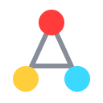

<div align="center">



# AboveAllGraphs

**A code knowledge graph that installs itself, keeps itself fresh, and works with every coding agent.**

[](https://github.com/thewaifucorp/above-all-graphs/actions/workflows/ci.yml)
[](https://www.npmjs.com/package/@waifucorp/aag)
[](LICENSE)
[](https://www.rust-lang.org)

</div>

---

Two commands. That's the entire workflow:

```bash
aag bigbang   # once per repo: index it + wire up every coding agent you have
aag ui        # whenever you want to look: opens the browser, all your repos in one app
```

No API key, no native compile step, no config file, nothing to keep in sync by hand. One static Rust binary.

## Highlights

- **Self-installing** — `bigbang` detects every coding agent on the machine and registers MCP servers, hooks, skills, and rules for each one. Idempotent, additive, reversible.
- **Always fresh** — native filesystem watcher, reconciliation on every MCP connect, agent hooks that resync after every edit. There is no "reindex" command to remember.
- **Deterministic** — parsing via tree-sitter, storage in SQLite, no LLM in the indexing path. Everything local; nothing leaves your machine.
- **100% offline UI** — interactive WebGL graph, per-module wiki, god-node report. Every asset vendored into the binary; the whole site also works as static files with no server.
- **Multi-workspace** — every repo you index appears in one hub. Local graphs, no central server.
- **Polyglot contracts** — 20 languages plus OpenAPI/Swagger, SQL DDL, and Terraform/HCL feed one provenance-aware graph.
- **File-level incremental** — edits reparse only the changed file while persisted references keep cross-file edges correct.
- **MCP everywhere** — stdio by default, or authenticated loopback HTTP for remote-capable clients.
- **Repository groups** — organize independent graphs under names such as `platform/backend` and query the hierarchy together.

## Install

```bash
npm install -g @waifucorp/aag
```

That's it — postinstall downloads the prebuilt binary for your platform (linux/macos/windows, x64 + arm64) from [GitHub Releases](https://github.com/thewaifucorp/above-all-graphs/releases); nothing compiles.

Building from source instead:

```bash
git clone https://github.com/thewaifucorp/above-all-graphs
cd above-all-graphs && cargo build --release   # binary at target/release/aag
```

Local semantic embeddings are an optional source-build feature because ONNX
substantially increases build and binary size:

```bash
cargo build --release --features semantic
aag embeddings --path .
```

## Why

`aag` is a synthesis of three tools, keeping each one's strength and cutting each one's weakness:

- **[GitNexus](https://github.com/abhigyanpatwari/GitNexus)** — real code graph (callers, impact, rename, cypher), but a heavy install (C++ toolchain, onnxruntime) and no incremental indexing.
- **[Graphify](https://github.com/Graphify-Labs/graphify)** — storytelling layer over the graph (`graph.html`, `GRAPH_REPORT.md`), but CDN-dependent output and Python tooling.
- **[CodeGraph](https://github.com/colbymchenry/codegraph)** — install-and-forget philosophy (hooks registered automatically), which `aag` adopts as a non-negotiable.

## The UI

`aag ui` starts a local server (127.0.0.1 only) and opens your browser:

- **One bar of lib-level chrome**: workspace picker, stats, a `+ index` button to index a new repo without touching the terminal.
- **The workspace fills the rest**: interactive WebGL graph (modules by color, drag, zoom-revealed labels, click a node to read the full source), per-module wiki, and a report of god nodes and surprising connections — each page carries its own navigation.
- The registry is read live on every request: index a repo anywhere, it appears in the picker.

Everything the UI serves is also a **static site** at `<repo>/.aag/` — open `index.html` directly with no server, send it to someone, host it anywhere. Fully offline: every asset is vendored into the binary, no CDN, ever.

Built-in multi-provider AI chat (Anthropic, OpenAI, Azure, Gemini, OpenRouter, MiniMax, GLM, Ollama) grounded on the graph — your key goes straight from the browser to the provider.

## Automatic agent integration

`aag bigbang` detects every agent on the machine — config dir in the repo or your home — and registers everything each one needs:

| Agent       | MCP config                | Hooks                                            | Guidance                  |
|-------------|---------------------------|--------------------------------------------------|---------------------------|
| Claude Code | `.mcp.json`               | pre-edit warning, post-edit sync, session digest | 7 skills (`.claude/skills/`) |
| Cursor      | `.cursor/mcp.json`        | `afterFileEdit` sync (`.cursor/hooks.json`)      | `.cursor/rules/aag.mdc`   |
| Gemini CLI  | `.gemini/settings.json`   | —                                                | `GEMINI.md` (fenced)      |
| Kiro        | `.kiro/settings/mcp.json` | —                                                | `.kiro/steering/aag.md`   |
| opencode    | `opencode.json`           | —                                                | `AGENTS.md` (fenced)      |
| Codex       | `~/.codex/config.toml`    | —                                                | 7 skills (`.agents/skills/`) + `AGENTS.md` |
| Antigravity | (UI-managed)              | —                                                | `AGENTS.md` (fenced)      |

Idempotent (re-running never duplicates), additive (your existing hooks/servers/rules survive untouched), reversible (`aag uninstall` removes exactly what was written). Agents without hook systems stay fresh anyway — the MCP server reconciles on connect and runs the native watcher.

The Claude Code hooks are the deepest integration: **PreToolUse** warns the agent *before* it edits a file containing widely-used symbols ("`used` has 12 callers — check `aag impact` first"), **PostToolUse** resyncs the graph in the background after every edit, **SessionStart** injects a digest of the repo so the agent starts every session oriented.

## MCP surface

One strong default tool — `explore` — answers "how does X work", "how does X reach Y", area surveys: source verbatim grouped by file, call paths, and blast radius in one shot. Granular tools (`node`, `search`, `callers`, `callees`, `impact`, `rename`, `affected`, `cypher`, `detect_changes`, `wiki`) are unlisted by default; enable via `AAG_MCP_TOOLS=explore,impact,...`.

## CLI

```
aag bigbang [--force] [--no-viz] [--no-install] [--obsidian]   bootstrap everything, one shot
aag ui [--port N] [--no-open]   THE interface: local server + browser, all workspaces
aag explore <query>          how does X work / what calls X (MCP twin: explore)
aag impact <symbol>          transitive blast radius before you change something
aag communities [filter]    detected architectural clusters
aag processes [filter]      detected entrypoints and execution flows
aag status                  index counts, communities, and processes
aag rename <old> <new> [--write]   coordinated multi-file rename, preview-first
aag affected --stdin         test files affected by a diff (pipe git diff --name-only)
aag export [--output <path>]  compile graph.db to an AAG Protocol manifest
aag validate <manifest>       structural + semantic protocol validation
aag describe <doc> <text>    attach a vision-pass description to an image/PDF node
aag sync [--file <path>]     reparse one changed file + refresh edges/site
aag embeddings               generate local semantic vectors (semantic build)
aag group <command>          named hierarchical multi-repo operations
aag workspaces               list every repo this machine has indexed
aag install [--force] / aag uninstall   agent integration, explicit
aag mcp                      MCP over stdio JSON-RPC
aag mcp --transport http     MCP HTTP on loopback (optional --api-key)
```

Every MCP tool has a CLI twin, so everything works in CI and pre-commit hooks too.

OpenAPI 3.x and Swagger 2.x YAML/JSON files are indexed automatically. Operations are stored as declared facts; AST symbols are observed facts. An `operationId` matching a code symbol creates an implementation link, and protocol export reports each contract operation as `matched` or `unmatched` under `extensions.x-aag-declared-contracts`.

The structural indexer covers 20 languages: Rust, JavaScript, TypeScript, Python, Java, C, C++, C#, Go, PHP, Ruby, Swift, Kotlin, Dart, Scala, Shell, Lua, R, Elixir, and Objective-C. Every frontend emits the same language-neutral graph model.

SQL DDL tables and foreign keys, Terraform/HCL resources, OpenAPI/Swagger contracts, text documentation, PDFs, images, Office documents, and video files share that graph. Binary/media formats are indexed immediately and can receive a host-agent description with `aag describe`.

## Multi-workspace

Each repo keeps its own local graph — no central server, no unified enterprise index. A lightweight registry (`~/.config/aag/workspaces.json`) records every workspace `bigbang`/`sync` touches; `aag ui` browses them all from one page, `aag workspaces` lists them in the terminal, and any command reaches a specific one with `--path`. Named groups such as `platform/backend` select related repositories while keeping their graphs independent. Stale entries prune themselves.

## Trust model for edges

Every edge carries a confidence tag:

- `EXTRACTED` — explicit in source (an import statement).
- `INFERRED` — resolved with real evidence: a module-qualified call (`sync::run`), a same-file definition, or a unique name.
- `AMBIGUOUS` — several symbols share the name and nothing disambiguates; verify before acting.

Transparency over false certainty — the graph tells you when it's guessing.

## Multimodal

Docs (`.md`/`.txt`) are indexed deterministically and linked to the symbols they mention (`explains` edges). Images/PDFs enter the graph as pending nodes; when running inside an agent, the *agent's own model* fills in the description (`aag describe`) — no separate API key, no cost outside the session you're already in.

## Exports

`graph.json`, GraphML (Gephi/yEd), Cypher (Neo4j/FalkorDB), optional Obsidian vault (`--obsidian`), plus the whole static site under `.aag/`.

## Development

```
cargo test          # 138 tests
cargo clippy        # pedantic, zero warnings
cargo build --release
```

Stack: Rust, tree-sitter, rusqlite (bundled SQLite + FTS5), tiny_http, notify, clap, serde_json.

This repo dogfoods itself: the `aag` hooks are active here.

## License

MIT
